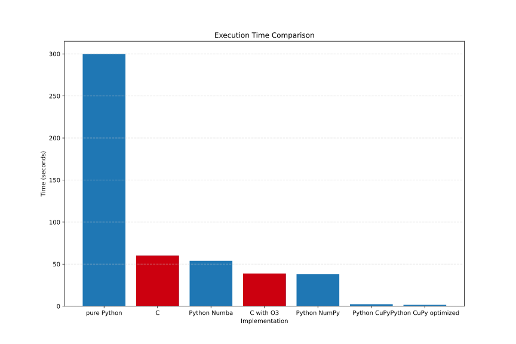

# Optimizing the sieve of Eratosthenes with compiled Python and CUDA

Python, as an interpreted language, offers significantly improved readability compared to compiled low-level languages like C or CUDA. Its dynamic nature also allows for faster development. However, the tradeoff usually lies in speed and energy efficiency per computation.

The goal of this project is to explore opportunities for overcoming this tradeoff by retaining Python's dynamic nature while achieving the speed and efficiency of low-level languages.

## Selected problem

The selected problem for implementation is the Sieve of Eratosthenes for the range of all unsigned 32-bit integers. The solution will include several implementations for comparison, including:

- Naive Python implementation using a list.
- Python implementation with just-in-time (JIT) compilation by Numba.
- Python implementation utilizing a NumPy array.
- Python implementation utilizing CUDA through CuPy.
- C implementation with and without O3 optimization.

## Results
All CPU implementations were tested on a laptop AMD Ryzen 7 5800H CPU, while CuPy implementation was tested on a laptop Nvidia RTX 3070 / Max-Q GPU.

## How to run

- make sure you have Cuda version 12+ installed
- install requirements
- run measure.sh
